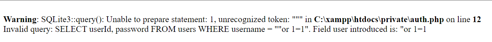

# Índice

- [Resumen Ejecutivo](#resumen-ejecutivo)
- [Tabla de Riesgos](#tabla-de-riesgos)
- [Evaluación](#evaluacion)
    - [Breve Resumen](#breve-resumen)
    - [Tabla de Hallazgos](#tabla-de-hallazgos)
      - [Vulnerabilidades Talent ScoutTech](#vulnerabilidades-talent-scouttech)
- [Metodologías](#metodologías)
  - [Herramientas utilizadas](#herramientas-utilizadas)
  - [Procedimiento](#procedimiento)
    - [Fase 1: Reconocimiento](#fase-1-reconocimiento)
    - [Fase 2: Explotación](#fase-2-explotación)
- [Conclusión](#conclusión)

# Resumen Ejecutivo

En este documento se detallan las vulnerabilidades encontradas en la aplicación Talent ScoutTech indicando su CWE, su severidad, su impacto y una serie de remediaciones que podrían mitigar o eliminar por completo dicha vulnerabilidad.

Además se incluye una metodología que además de especificar los procedimientos que se realizan en la prueba de pentesting, se incluye la herramienta realizada para ejercer fuerza bruta a la aplicación.También se incluye una conclusión final.

# Tabla de Riesgos

La siguiente tabla explica de forma clara y concisa la puntuación de los riesgos de los sistemas en una escala del 1 al 10.

| Riesgo | CVSSv3 | Descripción |
|--------|--------|-------------|
| CRÍTICA | 10 | Se describe una vulnerabilidad que ha sido calificada como crítica y requiere resolución tan rápida como sea posible. |
| ALTA | 7 - 9.9 | Se describe una vulnerabilidad que ha sido calificada como alta y requiere resolución a corto plazo. |
| MEDIA | 4 - 6.9 | Se describe una vulnerabilidad que ha sido calificada como media y debe resolverse como parte del mantenimiento de seguridad de un sistema. |
| BAJA | 1 – 3.9 | Se describe una vulnerabilidad que ha sido calificada como baja y debe ser abordada como parte de las tareas de mantenimiento rutinario. |
| INFO | 0 – 0.9 | Se realizó un descubrimiento de carácter informal y debe ser abordado con el fin de cumplir con una buena práctica de seguridad. |

# Evaluación

## Breve Resumen

Se especifican las distintas vulnerabilidades con su CWE especifico, prueba de concepto y descripción.

Además se incluye el impacto que podría tener dicha vulnerabilidad en nuestra aplicación y una serie de remediaciones.

## Tabla de hallazgos

### Vulnerabilidades Talent ScoutTech

| Descripción de la vulnerabilidad | El producto construye todo o parte de un comando SQL utilizando entradas influenciadas externamente desde un componente ascendente, pero no neutraliza o neutraliza incorrectamente elementos especiales que podrían modificar el comando SQL previsto cuando se envía a un componente descendente.|
|----------------------------------|--------------------------------------------------------------|
| CVE/CWE                          |        [CWE-89](https://cwe.mitre.org/data/definitions/89.html)                                                    |
| CVSS v3                          |          -         |
| Severidad                        |                       Alta                                |
| Impacto                          | Un atacante puede hacer leer información sensible, modificar, ejecutar comandos, eliminar datos o como en este caso acceder fácilmente a la página que queramos sin necesidad de contraseña   |
| Sistemas afectados               |       Talent ScoutTech |
| Prueba de concepto (POC)         |         |
| Remediación                      |           Validación de entradas de usuario, escapada de carácteres especiales y utilizar consultas preparadas.                                              |
| Link de referencia              |    [https://owasp.org/www-community/attacks/SQL_Injection](https://owasp.org/www-community/attacks/SQL_Injection)                                                        |
 

| Descripción de la vulnerabilidad | El producto no neutraliza o neutraliza incorrectamente la entrada controlable por el usuario antes de colocarla en la salida que se utiliza como una página web que se sirve a otros usuarios. |
|----------------------------------|--------------------------------------------------------------|
| CVE/CWE                |             [CWE-79](https://cwe.mitre.org/data/definitions/79.html)                     |
| CVSS v3  | - |
| Severidad                        |                  Alta                                        |
| Impacto                          |             Un atacante podría robar cookies de sesión, redirigir a sitios maliciosos y modificar el contenido de la página web.                                         |
| Sistemas afectados               |             Talent ScoutTech                                                |
| Prueba de concepto (POC)         |                                                             |
| Remediación                      |                Validación de entradas de usuario, escapada de carácteres especiales, codificar cualquier salida para contextos HTML                                     |
| Link de referencia               |         [https://owasp.org/www-community/attacks/xss/](https://owasp.org/www-community/attacks/xss/)          |

 

| Descripción de la vulnerabilidad | La aplicación web no verifica, o no puede, de manera suficiente si el usuario que envió la solicitud proporcionó intencionalmente una solicitud consistente, válida y bien formada. |
|----------------------------------|--------------------------------------------------------------|
| CVE/CWE                          |   [CWE-352](https://cwe.mitre.org/data/definitions/352.html) |
| CVSS v3   |        -     |
| Severidad  |    Alta  |
Impacto |   Un atacante podria cambiar información de una cuenta, realizar transacciones financieras sin necesidad de autenticación etc.    |
| Sistemas afectados               |    Talent ScoutTech |
| Prueba de concepto (POC)         |         Qué jugador tan impresionanteeeee! \|
Remediación   |     Verificar de Referers y tokens anti-CSRF.                         |
| Link de referencia               |    [https://owasp.org/www-community/attacks/csrf](https://owasp.org/www-community/attacks/csrf)    |         

| Descripción de la vulnerabilidad | El producto no implementa medidas suficientes para evitar múltiples intentos fallidos de autenticación en un corto período de tiempo, lo que lo hace más susceptible a ataques de fuerza bruta. |
|----------------------------------|--------------------------------------------------------------|
| CVE/CWE                          |        [CWE-307](https://cwe.mitre.org/data/definitions/307.html)   |
| CVSS v3                          |          -         |
| Severidad                        |                       Alta                                |
| Impacto                          | Un atacante puede realizar fuerza bruta a través de diccionarios de usuarios y contraseñas para conseguir acceder a la aplicación como uno de ellos.   |
| Sistemas afectados               |       Talent ScoutTech |
| Prueba de concepto (POC)         |         |
| Remediación                      |    Tener políticas robustas de contraseñas, bloqueo de cuenta al intentar un número de intentos de inicio de sesión, tener Captcha, monitorizar dicha actividad y tener autenticación de dos factores.            |
| Link de referencia              |    [https://owasp.org/www-community/attacks/Brute_force_attack](https://owasp.org/www-community/attacks/Brute_force_attack)                                                       |
# Metodologías

## Herramientas utilizadas

En este apartado se especifica la herramienta utilizada para la fuerza burta realizada.

- Hydra v9.5 (c) by Van Hauser THC & David Maciejak

## Procedimiento

### Fase 1: Reconocimiento

En primer lugar se han realizado escaneos automatizados utilizando la herramienta _Tenable© Nessus_, de la cual obtenemos un reporte que utilizaremos para guiar nuestra auditoría. 

Del reporte obtenemos información crucial que utilizaremos en la auditoría, como el nivel de riesgo que supone la vulnerabilidad para la seguridad de la máquina auditada, posibles CVEs que utilizaremos para guiarnos en su posterior intento de explotación y prueba de concepto (PoC).

Adicionalmente se realiza otro escaneo de puertos, servicios y posibles vulnerabilidades utilizando la herramienta _Nmap_ para listarlos, junto a los scripts por defecto de la herramienta, que se cruzarán con los resultados del reporte de _Nessus_ para mayor rigor.

### Fase 2: Explotación
Teniendo esta información disponible, se procederá a hacer uso del framework de pentesting _Metasploit_ para automatizar el uso de exploits debidamente elaborados para realizar una explotación de las vulnerabilidades descubiertas en la anterior fase de análisis. 

Una vez se realice un hallazgo, se documentará añadiendo su categoría y código en la clasificación CVE o CWE, su puntuación según CVSS asignada y en su defecto el cálculo de la misma por el auditor, una explicación concisa de la prueba de concepto realizada para llevar a cabo la explotación de esa vulnerabilidad, en la cual si es necesario se llevará a cabo la censura de la información sensible mediante el pixelado de la imagen. 

Finalmente se aportará un enlace de referencia a la vulnerabilidad en cuestión.

# Conclusión

En conclusión el no tener bien sanitizado el código de nuestras aplicaciones web o páginas web, estamos permitiendo a distintos atacantes aprovecharse de multiples vulnerabilidades que podrían dañar reputacionalmente a la empresa y a los clientes de la misma aplicación.
