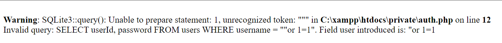
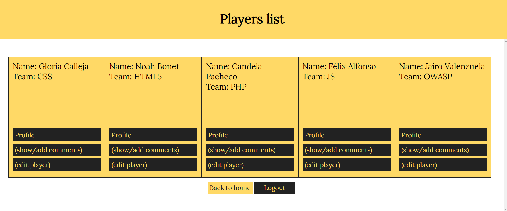
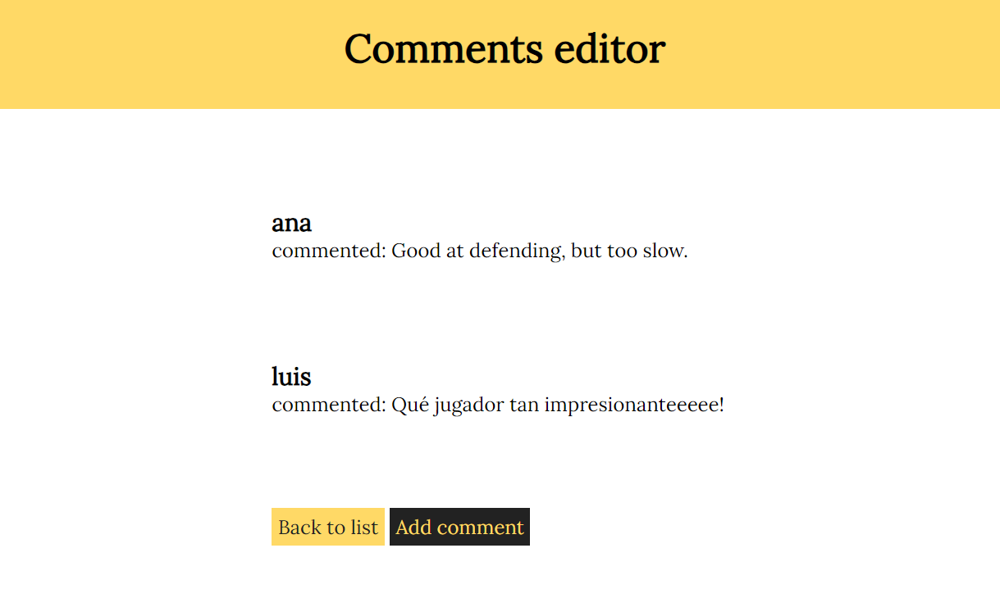

# Informe técnico - Talent ScoutTech

## Indice

- [Resumen Ejecutivo](#resumen-ejecutivo)
- [Objetivos](#objetivos)
- [Alcance](#alcance)
- [Parte 1 - SQLi](#parte-1---sqli)
- [Parte 2 - XSS](#parte-2---xss)
- [Parte 3 - Control de acceso, autenticación y sesiones de usuarios](#parte-3---control-de-acceso-autenticación-y-sesiones-de-usuarios)
- [Parte 4 - Servidores Web](#parte-4---servidores-web)
- [Parte 5 - CSRF](#parte-5---csrf)
- [Conclusiones](#conclusiones)

## Resumen Ejecutivo

En el presente informe técnico se responden a las preguntas dadas en cada parte.

Estas respuestas atienden a diferentes tipos de ataque web y a su solución. Estos ataques son inyección SQL, XSS y CSRF.

Además se plantean posibles sanitizaciones de código para mejorar la seguridad del registro y autenticación de los usuarios.

También se indican varias medidas a implementar para reducir el riesgo a ataques a nuestros servidores Web.

## Objetivos

Los objetivos de este informe técnico son:

- Identificar y explorar vulnerabilidades existentes dentro de Talent ScoutTech.

- Solucionar y mitigar estas vulnerabilidades en la aplicación Web.

## Alcance

El alcance de este informe técnico es la aplicación Web al completo de la empresa Talent ScoutTech.

## Parte 1 - SQLi

**a) Dad un ejemplo de combinación de usuario y contraseña que provoque un error en la consulta SQL generada por este formulario. Apartir del mensaje de error obtenido, decid cuál es la consulta SQL que se ejecuta, cuál de los campos introducidos al formulario utiliza y cuál no.**

Se ha escogido colocar "or 1=1 en el valor user ya que al hacerlo con comillas simples, no daba ningún tipo de error y te dejaba entrar para añadir nuevos jugadores. Por lo tanto se ha probado a usar la doble comilla para comprobar si esto mostraba error y ha sido mostrado.



| | |
|---|---|
| Escribo los valores | "or 1=1 |
| En el campo | users |
| Del formulario de la página | /insert_player.php |
| La consulta SQL que se ejecuta es | SELECT userId, password FROM users WHERE username = ""or 1=1". Field user introduced is: "or 1=1 |
| Campos del formulario web utilizados en la consulta SQL | User |
| Campos del formulario web **no** utilizados en la consulta SQL | Password |

**b) Gracias a la SQL Injection del apartado anterior, sabemos que este formulario es vulnerable y conocemos el nombre de los campos de la tabla “users”. Para tratar de impersonar a un usuario, nos hemos descargado un diccionario que contiene algunas de las contraseñas más utilizadas (se listan a continuación):**

**password**
**123456**
**12345678**
**1234**
**qwerty**
**12345678**
**dragon**
**Dad un ataque que, utilizando este diccionario, nos permita impersonar un usuario de esta aplicación y acceder en nombre suyo. Tened en cuenta que no sabéis ni cuántos usuarios hay registrados en la aplicación, ni los nombres de estos.**

| | |
|---|---|
| Explicación del ataque | El ataque consiste en repetir el login a través de la herramienta Hydra con la wordlist para usuarios llamada rockyou y una wordlist para contraseñas creada con el diccionario dado por la actividad. |
| Campo de usuario con que el ataque ha tenido éxito | luis |
| Campo de contraseña con que el ataque ha tenido éxito | 1234 |

**c) Si vais a private/auth.php, veréis que en la función areUserAndPasswordValid”, se utiliza “SQLite3::escapeString()”, pero, aun así, el formulario es vulnerable a SQL Injections, explicad cuál es el error de programación de esta función y como lo podéis corregir.**

| | |
|---|---|
| Explicación del error | El problema existe porque  la consulta SQL está directamente concatenando el nombre de usuario proporcionado en la consulta sin ningún tipo de validación. |
| Solución: Cambiar la línea con el código | $query = SQLite3::escapeString('SELECT userId, password FROM users WHERE username = "' . $user . '"'); |
| Por la siguiente línea | $stmt = $pdo->prepare('SELECT userId, password FROM users WHERE username = :username'); $stmt->execute(['username' => $user]); $row = $stmt->fetch(PDO::FETCH_ASSOC);
 |

**d) Si habéis tenido éxito con el apartado b), os habéis autenticado utilizando elusuario “luis” (si no habéis tenido éxito, podéis utilizar la contraseña “1234” para realizar este apartado). Con el objetivo de mejorar la imagen de la jugadora “Candela Pacheco”, le queremos escribir un buen puñado de comentarios positivos, pero no los queremos hacer todos con la misma cuenta de usuario.**

**Para hacer esto, en primer lugar habéis hecho un ataque de fuerza bruta sobre el directorio del servidor web (por ejemplo, probando nombres de archivo) y habéis encontrado el archivo “add_comment.php~”. Estos archivos seguramente se han creado como copia de seguridad al modificar el archivo “.php” original directamente al servidor. En general, los servidores web no interpretan (ejecuten) los archivos “.php~” sino que los muestran como archivos de texto sin interpretar.**

**Esto os permite estudiar el código fuente de “add_comment.php” y encontrar una vulnerabilidad para publicar mensajes en nombre de otros usuarios. ¿Cuál es esta vulnerabilidad, y cómo es el ataque que utilizáis para explotarla?**

| | |
|---|---|
| Vulnerabilidad detectada | Inyección de comentarios |
| Descripción del ataque | El atacante podría enviar un comentario que contiene código malicioso y cuando se muestre la página, el código de dentro del comentario se ejecutará. |
| ¿Cómo podemos hacer que sea segura esta entrada? | Creando consultas preparadas, escapar caracteres especiales con funciones o validando y escapando adecuadamente cualquier entrada de usuarios antes de insertarlas en la base de datos. |

## Parte 2 - XSS

**a) Para ver si hay un problema de XSS, crearemos un comentario que muestre un alert de Javascript siempre que alguien consulte el/los comentarios de aquel jugador (show_comments.php). Dad un mensaje que genere un «alert»de Javascript al consultar el listado de mensajes.**

Se ha utilizado un script simple para mostrar la alerta.

| | |
|---|---|
| Introduzco el mensaje | `<script>alert('¡Esto es una alerta!');</script>` |
| En el formulario de la página | add_comment.php?id=3 |

**b) Por qué dice "&" cuando miráis un link (como el que aparece a la portada de esta aplicación pidiendo que realices un donativo) con parámetros GET dentro de código html si en realidad el link es sólo con "&" ?**

| | |
|---|---|
| Explicación | El uso de &amp en lugar de & en HTML se debe a que & es un caracter especial en HTML que se utiliza para comenzar entidades HTML como &amp en el caso del enlace del donativo. |

No se exactamente que problema es el que 

**c) Explicad cuál es el problema de show_comments.php, y cómo lo arreglaríais. Para resolver este apartado, podéis mirar el código fuente de esta página.**

| | |
|---|---|
| ¿Cuál es el problema | El problema proviene en permitir al parametro id que se genere sin ninguna validación o escape. |
| Sustituyo el código de la/las líneas | \<a class="black" href="add_comment.php?id=<br /><br><b>Warning</b>:  Undefined variable $playerId in <b>C:\xampp\htdocs\show_comments.php</b> on line <b>46</b><br /><br>"> Add comment\</a>
 |
| Por el siguiente código | \<a class="black" href="add_comment.php?id=<?php echo htmlspecialchars($playerId); ?<br>">Add comment\</a>
 |


**d) Descubrid si hay alguna otra página que esté afectada por esta misma vulnerabilidad. En caso positivo, explicad cómo lo habéis descubierto.**


| | |
|---|---|
| Otras páginas afectadas | /insert_player.php |
| ¿Cómo lo he descubierto? | Puesto que en esta página tampoco se sanitiza bien el código para validar y escapar cualquier carácter especial. |

## Parte 3 - Control de acceso, autenticación y sesiones de usuarios

**a) En el ejercicio 1, hemos visto cómo era inseguro el acceso de los usuarios a la aplicación. En la página de register.php tenemos el registro de usuario. ¿Qué medidas debemos implementar para evitar que el registro sea inseguro? Justifica esas medidas e implementa las medidas que sean factibles en este proyecto.**

Utilizar consultas preparadas en lugar de construir las consultas directamente con los datos de los formularios.

Validar las entradas para asegurar de que no se incluya código malicioso.

Sanitizar la entrada para eliminar caracteres especiales que puedan ser interpretados por HTML o javascript.

```
<?php
require_once dirname(__FILE__) . '/private/conf.php';

if (isset($_POST['username']) && isset($_POST['password'])) {
    $username = $_POST['username'];
    $password = $_POST['password'];

    // Validación de entrada
    if (strlen($username) < 4 || strlen($username) > 20) {
        die("Username must be between 4 and 20 characters long.");
    }

    if (strlen($password) < 6) {
        die("Password must be at least 6 characters long.");
    }

    // Sanitización de entrada
    $username = filter_var($username, FILTER_SANITIZE_STRING);
    // No es necesario sanitizar la contraseña, ya que la vamos a hashear más adelante

    // Consulta preparada
    $query = "INSERT INTO users (username, password) VALUES (:username, :password)";
    $stmt = $db->prepare($query);
    $stmt->bindParam(':username', $username);
    
    // Hasheamos la contraseña antes de almacenarla
    $hashed_password = password_hash($password, PASSWORD_DEFAULT);
    $stmt->bindParam(':password', $hashed_password);

    // Ejecutar la consulta
    if ($stmt->execute()) {
        header("Location: list_players.php");
        exit();
    } else {
        die("Error executing query.");
    }
}
?>

<!doctype html>
<html lang="es">
    <head>
        <!-- Encabezado omitido por brevedad -->
    </head>
    <body>
        <header>
            <h1>Register</h1>
        </header>
        <main class="player">
            <form action="#" method="post">
                <!-- Formulario omitido por brevedad -->
            </form>
            <form action="#" method="post" class="menu-form">
                <a href="list_players.php">Back to list</a>
                <input type="submit" name="Logout" value="Logout" class="logout">
            </form>
        </main>
        <footer class="listado">
            <!-- Pie de página omitido por brevedad -->
        </footer>
    </body>
</html>
```

**b) En el apartado de login de la aplicación, también deberíamos implantar una serie de medidas para que sea seguro el acceso, (sin contar la del ejercicio 1.c). Como en el ejercicio anterior, justifica esas medidas e implementa las que sean factibles y necesarias (ten en cuenta las acciones realizadas en el register). Puedes mirar en la carpeta private**

Se ha añadido hashing de contraseñas con la función areUsersAndPasswordValid que utiliza password_verify para comparar contraseñas almacenadas en la base de datos. Además se generan consultas preparadas con la misma función.


```
<?php
require_once dirname(__FILE__) . '/conf.php';

$userId = FALSE;

# Check whether a pair of user and password are valid; returns true if valid.
function areUserAndPasswordValid($user, $password) {
    global $db, $userId;

    $query = "SELECT userId, password FROM users WHERE username = :username";
    $stmt = $db->prepare($query);
    $stmt->bindValue(':username', $user);
    $stmt->execute();
    $row = $stmt->fetch(PDO::FETCH_ASSOC);

    if ($row && password_verify($password, $row['password'])) {
        $userId = $row['userId'];
        return true;
    } else {
        return false;
    }
}

# On login
if (isset($_POST['username']) && isset($_POST['password'])) {        
    if (areUserAndPasswordValid($_POST['username'], $_POST['password'])) {
        session_start();
        $_SESSION['user'] = $_POST['username'];
        header("Location: index.php");
        exit();
    } else {
        $error = "Invalid user or password.<br>";
    }
}

# On logout
if (isset($_POST['Logout'])) {
    session_destroy();
    header("Location: index.php");
    exit();
}

if (!isset($_SESSION['user'])) {
?>
<!doctype html>
<html lang="es">
<head>
    <!-- Encabezado omitido por brevedad -->
</head>
<body>
<header class="auth">
    <h1>Authentication page</h1>
</header>
<section class="auth">
    <div class="message">
        <?= isset($error) ? $error : "" ?>
    </div>
    <section>
        <div>
            <h2>Login</h2>
            <form action="#" method="post">
                <label>User</label>
                <input type="text" name="username"><br>
                <label>Password</label>
                <input type="password" name="password"><br>
                <input type="submit" value="Login">
            </form>
        </div>

        <div>
            <h2>Logout</h2>
            <form action="#" method="post">
                <input type="submit" name="Logout" value="Logout">
            </form>
        </div>
    </section>
</section>
<footer>
    <!-- Pie de página omitido por brevedad -->
</footer>
</body>
</html>
<?php
    exit();
}

$_SESSION['user'] = $_POST['username'];
?>
```

**c) Volvemos a la página de register.php, vemos que está accesible para cualquier usuario, registrado o sin registrar. Al ser una aplicación en la cual no debería dejar a los usuarios registrarse, qué medidas podríamos tomar para poder gestionarlo e implementa las medidas que sean factibles en este proyecto.**

Verificar el estado de autenticación antes de mostrar esta página y en caso de, estar registrado, redirigirte a otra página. Verificar la ausenscia de la variable de sesión para determinar si el usuario ha sido autenticado.

**d) Al comienzo de la práctica hemos supuesto que la carpeta private no tenemos acceso, pero realmente al configurar el sistema en nuestro equipo de forma local. ¿Se cumple esta condición? ¿Qué medidas podemos tomar para que esto no suceda?**

No, no se ha cumplido puesto que podemos acceder fácilmente desde la propia web. Para ello deberiamos, mover la carpeta fuera del directorio raíz del servidor web, restringir el acceso mediant reglas en el archivo .htaccess y denegar el acceso a dicho directorio desde el navegador.

**e) Por último, comprobando el flujo de la sesión del usuario. Analiza si está bien asegurada la sesión del usuario y que no podemos suplantar a ningún usuario. Si no está bien asegurada, qué acciones podríamos realizar e implementarlas.**

Verificando el uso de HTTPS, utilizar configuraciones seguras para las cookies e implementar tokens CSRF.

## Parte 4 - Servidores web

**¿Qué medidas de seguridad se implementariaís en el servidor web para reducir el riesgo a ataques?**

Las medidas que implementaría son:

- Actualizar el software regularmente.
- No utilizar wordpress ya que existen plugins desactualizados y por lo tanto inseguros.
- Tener un firewall para controlar el tráfico entrante para impedir ataques DDOS. 
- Monitorizar y registrar eventos.
- Sistema de detección y prevención de intrusiones.

## Parte 5 - CSRF

Ahora ya sabemos que podemos realizar un ataque XSS. Hemos preparado el siguiente enlace: http://web.pagos/donate.php?amount=100&receiver=attacker, mediante el cual, cualquiera que haga click hará una donación de 100€ al nuestro usuario (con nombre 'attacker') de la famosa plataforma de pagos online 'web.pagos' (Nota: como en realidad esta es una dirección inventada, vuestro navegador os devolverá un error 404).

**a) Editad un jugador para conseguir que, en el listado de jugadores (list_players.php) aparezca, debajo del nombre de su equipo y antes de “(show/add comments)” un botón llamado “Profile” que corresponda a un formulario que envíe a cualquiera que haga clic sobre este botón a esta dirección que hemos preparado.**

Se ha editado globalmente a través del código de la página list_players.php para asegurarnos de que no difieran entre ellos y levantar menos sospechas.



**b) Una vez lo tenéis terminado, pensáis que la eficacia de este ataque aumentaría si no necesitara que el usuario pulse un botón. Con este objetivo, cread un comentario que sirva vuestros propósitos sin levantar ninguna sospecha entre los usuarios que consulten los comentarios sobre un jugador (show_comments.php).**



El comentario añadido es:
```
Qué jugador tan impresionanteeeee!
<script type="text/javascript">
    setTimeout(function() {
        window.location.href = "http://web.pagos/donate.php?amount=100&receiver=attacker";
    }, 2000);
</script>
```

Con este comentario el navegador espera 2000 milisegundos y te redirige a la web del punto anterior.

**c) Pero 'web.pagos' sólo gestiona pagos y donaciones entre usuarios registrados, puesto que, evidentemente, le tiene que restar los 100€ a la cuenta de algún usuario para poder añadirlos a nuestra cuenta.**

**Explicad qué condición se tendrá que cumplir por que se efectúen las donaciones de los usuarios que visualicen el mensaje del apartado anterior o hagan click en el botón del apartado a).**

La victima debe:

- Estar registrada en la plataforma web.pagos.
- Tener fondos suficientes para la donación.

**d) Si 'web.pagos' modifica la página 'donate.php' para que reciba los parámetros a través de POST, quedaría blindada contra este tipo de ataques? En caso negativo, preparad un mensaje que realice un ataque equivalente al de la apartado b) enviando los parámetros “amount” i “receiver” por POST.**

No sé exactamente como hacerlo.

## Conclusiones

Después de realizar las respuestas a las preguntas y analizar el código, he llegado a la conclusión de que si no se itiza bien el código de nuestras páginas web, generamos una serie de vulnerabilidades que permiten campar a sus anchas dentro de nuestra aplicación a cualquier atacante que las encuentre.
